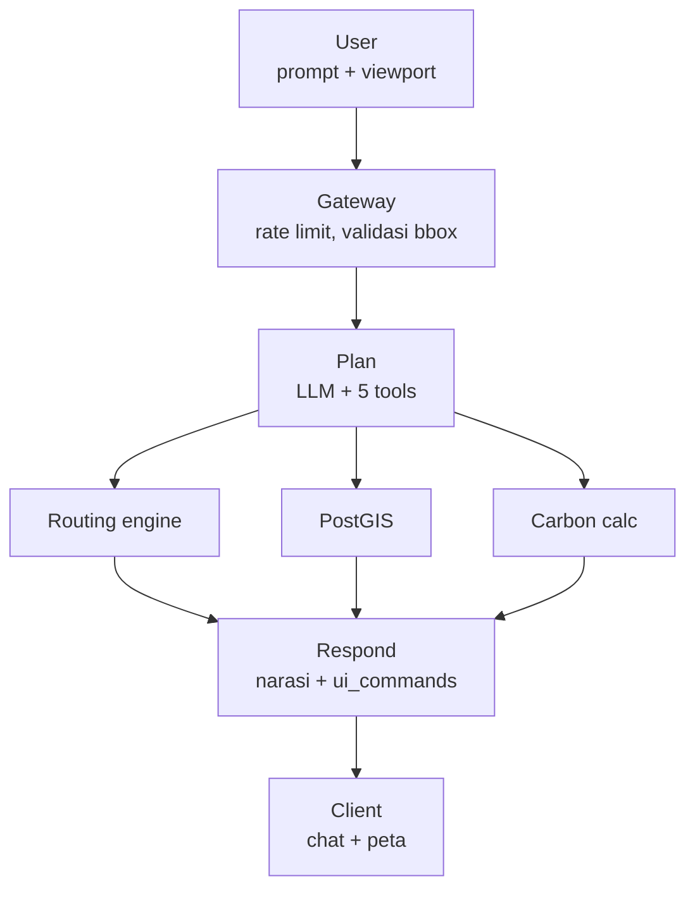

# AI Integration Flow — PRD §8

```mermaid
flowchart TD
    U["User<br/>prompt + viewport"] --> GW["Gateway<br/>rate limit, validasi bbox"]
    GW --> PLAN["Plan<br/>LLM + 5 tools"]
    PLAN --> ROUTE["Routing engine"]
    PLAN --> GIS["PostGIS"]
    PLAN --> CARBON["Carbon calc"]
    ROUTE --> RESP["Respond<br/>narasi + ui_commands"]
    GIS --> RESP
    CARBON --> RESP
    RESP --> CLIENT["Client<br/>chat + peta"]
```
