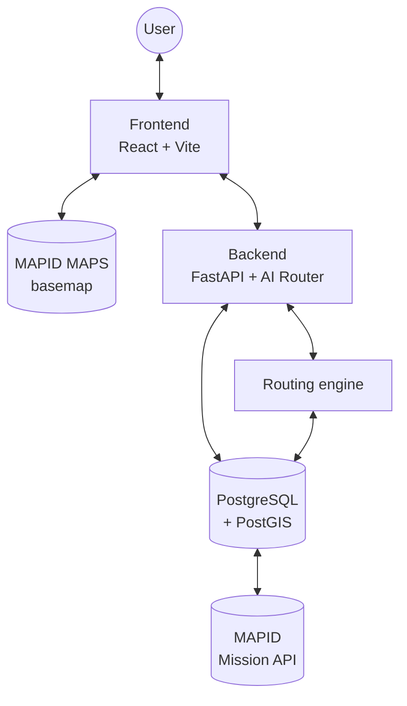

# Technology Architecture — PRD §10

```mermaid
flowchart TD
    U(("User")) <--> FE["Frontend<br/>React + Vite"]
    FE <--> BASEMAP[("MAPID MAPS<br/>basemap")]
    FE <--> BE["Backend<br/>FastAPI + AI Router"]
    BE <--> ROUTE["Routing engine"]
    BE <--> DB[("PostgreSQL<br/>+ PostGIS")]
    ROUTE <--> DB
    DB <--> MAPID[("MAPID<br/>Mission API")]
```
